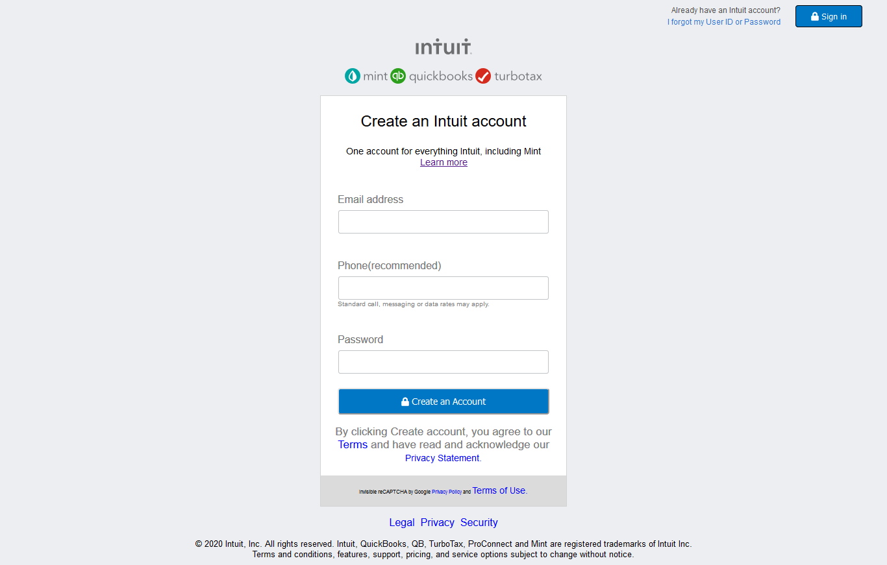

# MC-project2-HTMLForm
## Microverse HTML Form Project 2 - Collaborative
Collaborative Project with peer to create a sign up Intuit clone, using basic HTML and CSS.

#### I. The main focus of the project was the creation of a standard form by using input fields, buttons and headings.

#### II. The project was not prepared for mobile use and no mobile queries were used.

#### III. The main areas of the project can be divided as follows:

  ###### &nbsp; A Background Section
  It was subdivided into two buttons, a title paragraph and a terms and conditions footer.

  ###### &nbsp; The login section
  It comprised the three text input fields and a button

## Built With

- HTML, CSS
- Code Editors- Atom and VS Code
- [Fontawesome CSS Library](https://fontawesome.com/)

## Live Demo

- [Live Demo Link](https://rawcdn.githack.com/Jhdezj/MC-project2-HTMLForm/9918f2930952eebc5fb308f88cf61115959c289c/index.html)

## Authors

👤 **Romel Madray**

- Github: [@Romel4321](https://github.com/Romel4321)

👤 **Jorge Hernandez**

- Github: [@Jhdezj](https://github.com/Jhdezj)
